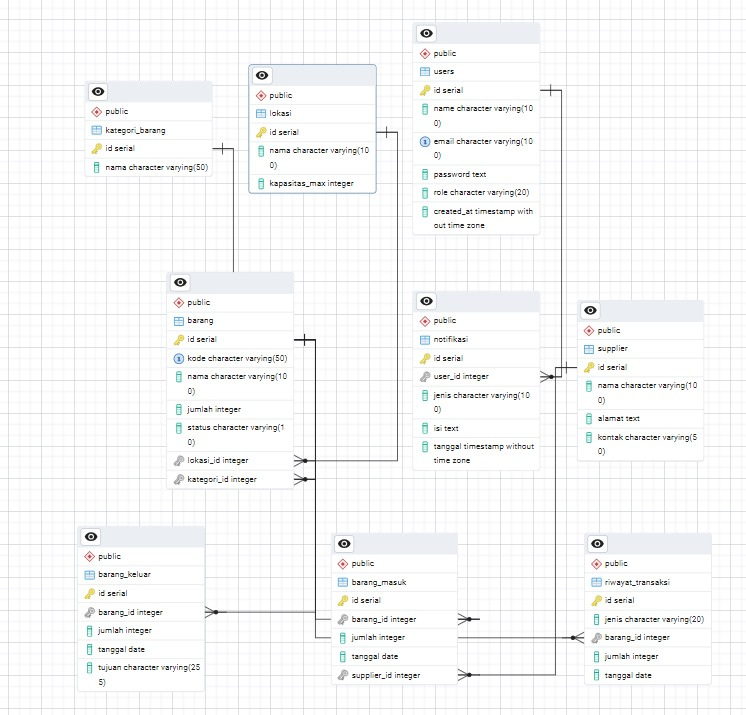
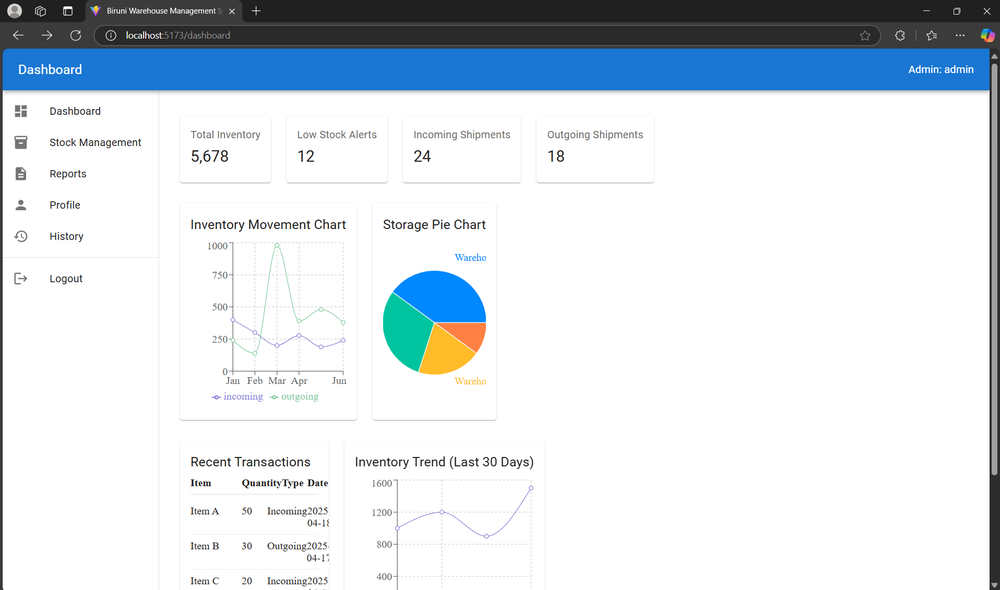
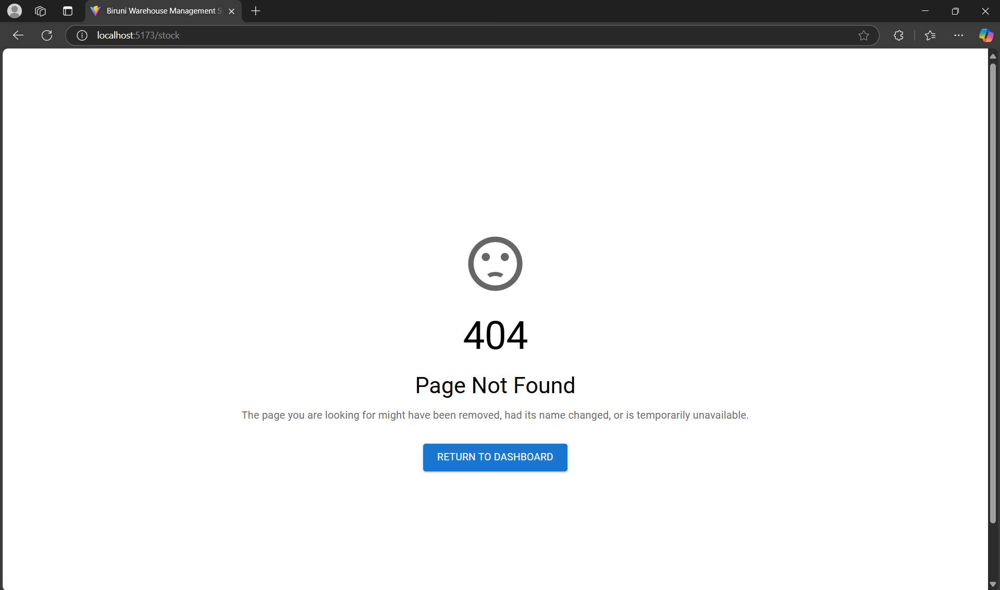
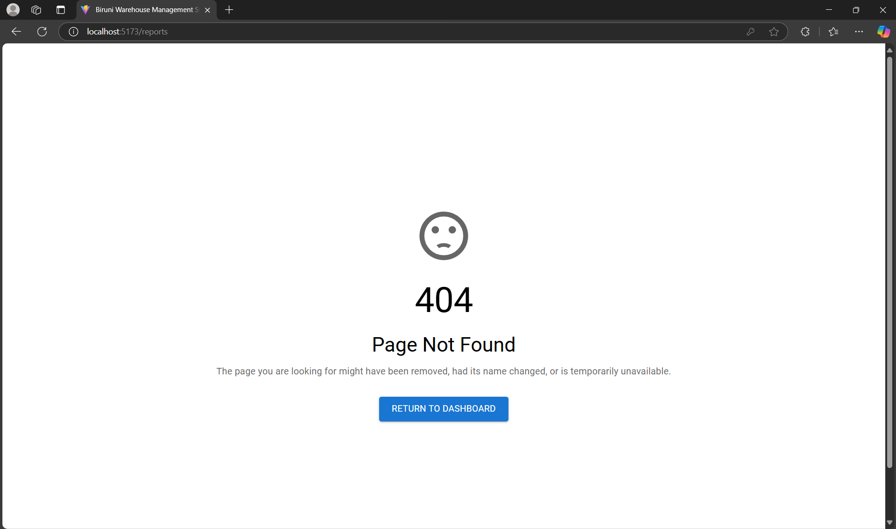
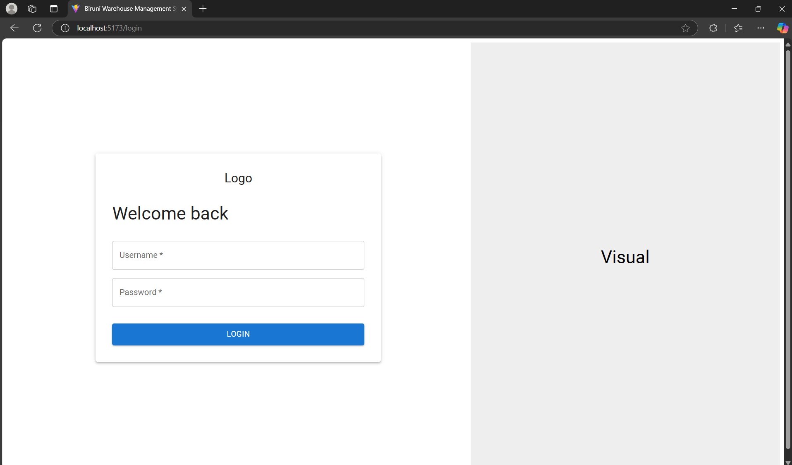

# 📌 Laporan Progres Mingguan - **Sistem Manajemen Gudang Biruni**
**Kelompok**: A7  
**Mitra**: PT. Biruni Altha Etam  
**Pekan ke-**: 10  
**Tanggal**: 18 April 2025  

---

## ✅ Progress Summary
Pada minggu ini, kami memulai pengerjaan proyek tugas besar mata kuliah *Pemrograman Web*. Fokus utamanya adalah pada **perancangan Database Design** dan **pembangunan struktur awal frontend** aplikasi.

---

## 🚀 Accomplished Tasks

### 🗂️ 1. Perancangan Skema Database
- Membuat rancangan struktur tabel yang akan digunakan untuk menyimpan data penting dalam aplikasi.

 

---

### 🧭 2. Setup Struktur Halaman Dasar (Frontend)
Menggunakan `react-router` untuk mengatur navigasi antar halaman utama:
- **Dashboard** – Menampilkan overview stok dan aktivitas terakhir.  
  

- **Stok** – Mengelola data barang masuk/keluar dan ketersediaan.
 *(Halaman masih dalam tahap pengembangan, sementara ini menampilkan halaman Not Found)*   

- **Laporan** – Menyajikan data statistik dan ekspor laporan.  
  
  *(Halaman masih dalam tahap pengembangan, sementara ini menampilkan halaman Not Found)* 

- **Profile (Opsional)** – Untuk pengaturan user.  
  
*(Halaman masih dalam tahap pengembangan, sementara ini menampilkan halaman Not Found)* 
---

### 🧩 3. Komponen Statis
- **Sidebar, Navbar, dan Footer** sudah diimplementasikan sebagai komponen reusable.

---

### 🔐 4. Halaman Login
Mengembangkan halaman login yang terdiri dari input untuk username dan password, tombol login, serta tampilan visual dengan layout terbagi dua (split layout) antara sisi kiri dan kanan.
  

---

## ⚠️ Challenges & Solutions

| Challenge | Solusi |
|----------|--------|
| **Frontend tidak menemukan page/components** | Memeriksa kemungkinan typo atau kesalahan penulisan pada import dan path file. |
| **Kebingungan menghubungkan PostgreSQL lokal ke PostgreSQL di Railway** | Mencari tutorial melalui internet atau YouTube. |

---

## 📅 Next Week Plan

### 🔧 Frontend
- Mengintegrasikan autentikasi menggunakan JWT
- Menyiapkan *protected routes* dan menghubungkan sistem autentikasi dengan frontend

### ⚙️ Backend
- Mengimplementasikan middleware untuk validasi JWT
- Menyiapkan sistem token untuk otorisasi
- Membuat API CRUD untuk pengelolaan data

### 🎨 UI/UX
- Melakukan user testing untuk mengevaluasi alur navigasi dan form input
- Mendesain ulang tampilan halaman login, profil, dan dashboard agar lebih user-friendly

### 🧪 QA
- Melakukan unit testing pada bagian backend
- Menyiapkan environment khusus untuk pengujian fitur berbasis JWT

---

## 👥 Contributions

| Nama | Kontribusi |
|------|------------|
| **Adhyasta Firdaus** | Pembuatan Database |
| **Gabriel Karmen Sanggalangi** | Pengujian error login dan halaman not found |
| **Dhiya Afifah** | Pengembangan struktur Dashboard dan Login |
| **Ansellma Tita Pakartiwuri Putri** | Pengecekan frontend |

---

