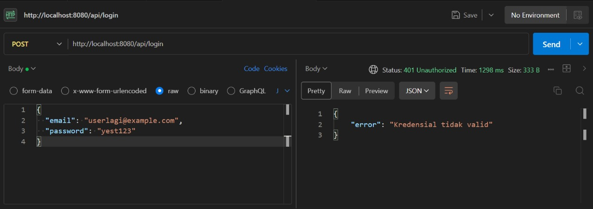

# 📌 Laporan Progres Mingguan - **Sistem Manajemen Gudang Biruni**

**Kelompok**: 7  
**Anggota**:
- Adhyasta Firdaus (10231005)
- Ansellma Tita Pakartiwuri Putri (10231017)
- Dhiya Afifah (10231031)
- Gabriel Karmen Sanggalangi (10231039)

**Mitra**: PT. Biruni Altha Etam  
**Pekan ke-**: 11  
**Tanggal**: 22 April 2025 - 28 April 2025

---

## 📈 Progress Summary

Pada minggu ini, kelompok kami telah mengerjakan beberapa progres dalam perancangan sistem manajemen gudang Biruni, yaitu:

- **Autentikasi User**:
  - Login sebagai admin
  - Logout
- **Menambah Page untuk Setiap Route**:
  - Manajemen Stok
  - Profil User
  - Report
  - History
- **Endpoint Dasar**:
  - `/login`
  - `/logout`
  - `/token/refresh`
- **Stock Manajemen**:
  - Menampilkan halaman stok manajemen
  - Menghapus stok
- **Profile User**:
  - Menampilkan profil user
  - Menghubungkan profil dengan session user
  - Update profile

---

## ✅ Accomplished Tasks

### 1. Backend Development (Express.js & Node.js)
- Menambahkan autentikasi JWT
- Menambahkan endpoint baru
- Merapikan struktur kode backend

### 2. Frontend Development (Vite)
- Membuat halaman login/register yang responsif
- Menampilkan profile terhubung dengan session user
- Merapikan tampilan layout

### 3. Database & API
- Melakukan koneksi ke public server (Render & Railway)
- Menyusun API endpoints untuk autentikasi
- Membuat relasi antar tabel (foreign keys)
- Menyiapkan data seeding untuk testing

---

## ⚡ Challenges & Solutions

| *Challenge*                                                      | *Solution*                                                                                             |
|--------------------------------------------------------------------|----------------------------------------------------------------------------------------------------------|
| **1. Halaman profile.jsx tidak dapat diperbarui**                 | Menganalisis penyebab masalah dan memperbaiki cara frontend dalam mengambil data dengan benar.             |
| *2. Autentikasi login gagal akibat masalah dengan JWT*            | Menyesuaikan kode frontend dan backend agar sesuai dengan cara yang benar dalam menggunakan token yang valid.|
| *3. Gagal menampilkan tabel*                                      | Menambahkan otentikasi, controller, dan route, serta memperbaiki cara halaman mengambil data yang diperlukan.|
| *4. Gagal mengambil informasi stok berdasarkan ID*               | Menganalisis kesalahan dan rencana perbaikan akan dilakukan pada minggu depan.                             |

---

## 📅 Next Week Plan

- **Stock Manajemen**:
  - Membuat fungsi CRUD untuk stok
  - Menambahkan fitur pencarian barang
  - Mengelola barang masuk dan keluar

- **Report**:
  - Membuat fungsi CRUD untuk laporan
  - Menambahkan fitur pencarian dan eksport laporan

- **Perbaikan UI/UX**:
  - Menyempurnakan tampilan layout
  - Menambahkan animasi dan transisi
  - Membuat tampilan lebih responsif

- **Pengujian Integrasi**:
  - Tes koneksi API
  - Validasi format request dan response
  - Tes autentikasi dan keamanan data

---

## 🤝 Contributions

Adhyasta Firdaus:
- Mengembangkan endpoint untuk *user, **authentication, dan **router*.
- Membuat *controller, **middleware, **authentication, dan **routes*.
- Melakukan revisi pada struktur folder backend.
- Menghubungkan database ke *Railway* dan *pgAdmin, dengan menggunakan database **PostgreSQL*.

Ansellma Tita Pakartiwuri Putri 
- Membuat mockup yang lebih rapi dan siap untuk diimplementasikan.
- Membantu tim frontend dalam pembuatan layout dan desain antarmuka.
- Monitoring dan controlling jobdesk

Dhiya Afifah
- Membuat layout dan komponen yang dibutuhkan untuk *stock management*.
- Membuat halaman untuk semua bagian aplikasi.
- Merapikan antarmuka pengguna (UI) dan memastikan tampilan *mobile-friendly*.

Gabriel Karmen Sanggalangi
- Melakukan *integrasi test* untuk memastikan fungsionalitas aplikasi.
- Melakukan pengecekan dan verifikasi proses *deployment*.

---

## 🖼️ Screenshots / Demo

### 1. Autentikasi User

#### Login

> Form validasi email dan password, fitur lihat password, serta error handling pada input.

---

### 2. Menambah Page di Setiap Route

> Penambahan halaman Manajemen Stok, Report, History, dan Profil User. (Masih dalam tahap awal pengembangan fungsi masing-masing).

---

### 3. Endpoint Dasar

# 📦 Warehouse Management System - API Documentation

### 🛠️ Authentication Endpoints
| Route             | Method | Access  | Description                                     |
|-------------------|--------|---------|-------------------------------------------------|
| `/login`          | POST   | Public  | Login user dan mendapatkan token JWT.           |
| `/logout`         | POST   | Public  | Logout user (opsional, hanya konfirmasi).       |
| `/token/refresh`  | POST   | Private | Refresh token JWT dengan token yang valid.      |

---

### 📦 Stock Management Endpoints
| Route               | Method | Access  | Description                                           |
|---------------------|--------|---------|-------------------------------------------------------|
| `/stock`            | GET    | Private | Mengambil semua data stok barang. Support search, filter, sort. |
| `/stock/:id`        | GET    | Private | Mengambil satu data stok berdasarkan ID.              |
| `/stock`            | POST   | Private | Menambahkan stok barang baru ke sistem.               |
| `/stock/:id`        | PUT    | Private | Update seluruh field stok berdasarkan ID.             |
| `/stock/:id`        | DELETE | Private | Menghapus stok barang berdasarkan ID.                 |

---

### 👤 User Management Endpoints
| Route                   | Method | Access  | Description                                    |
|--------------------------|--------|---------|------------------------------------------------|
| `/user`                  | GET    | Private | Mengambil profil user yang sedang login.       |
| `/profile/update`        | PUT    | Private | Update data profil user yang sedang login.     |

---

> Semua endpoint mengembalikan error code standar:  
> - 400 Bad Request  
> - 401 Unauthorized  
> - 404 Not Found  
> - 500 Server Error

---

### 4. Stock Management

> Menampilkan daftar stok barang, fitur hapus sudah berfungsi, fitur tambah dan edit masih dalam proses.

---

### 5. Profil User

> Menampilkan data profil user yang terhubung dengan session, termasuk fitur update profil.

---

### 6. Integration Test

#### Authentication Endpoint
- **Login Berhasil**  
  
  - **Melakukan pengujian terhadap POST /api/login dengan kredensial yang benar menghasilkan respons sukses dan berhasil login.**
- **Login - Password Salah**  
  
Pengujian terhadap POST /api/login dengan password yang salah menghasilkan pesan kesalahan "Kredensial tidak valid".
- **Login - Data Kosong**  
  
 Pengujian terhadap POST /api/login dengan data yang kosong menghasilkan pesan kesalahan "Email dan password dibutuhkan", yang menunjukkan bahwa semua field wajib diisi.
- **Login - Email Salah**  
  
Pengujian terhadap POST /api/login dengan email yang salah menghasilkan pesan kesalahan "Kredensial tidak valid".
- **Logout Berhasil**  
  
Berhasil melakukan logout menggunakan POST /api/logout, dan sistem memberikan respons "Logout berhasil".
- **Refresh Token**  
  
Berhasil melakukan refresh token menggunakan POST /api/token/refresh, token baru berhasil dihasilkan dan diterima.
- **Tanpa Token (Akses Ditolak)**  
  

---

#### Stock Management Testing
- **Mengambil Informasi Stok**  
  
Berhasil melakukan pengambilan data stock menggunakan GET /api/stock, dan data berhasil ditampilkan dengan benar.
- **Mengambil Informasi Stok Berdasarkan ID (Gagal)**  
  
Pengambilan data stock berdasarkan ID menggunakan GET /api/stock/:id juga belum berhasil dilakukan.
- **Menambah Data Stok (Gagal)**  
  
Saat ini, proses penambahan data ke stock menggunakan POST /api/stock belum berhasil dilakukan.