# 📌 Laporan Progres Mingguan - **Sistem Manajemen Gudang Biruni**

**Kelompok**: 7
**Anggota**:
- Adhyasta Firdaus (10231005)
- Ansellma Tita Pakartiwuri Putri (10231017)
- Dhiya Afifah (10231031)
- Gabriel Karmen Sanggalangi (10231039)

**Mitra**: PT. Biruni Altha Etam
**Pekan ke-**: 12
**Tanggal**: 2 Mei 2025

---

## 📈 Ringkasan Progres

Pada minggu ini, kami berhasil menyelesaikan fungsionalitas CRUD untuk Stock Management, mengimplementasikan fitur menambahkan dan mengeluarkan barang dengan notifikasi di halaman History, serta menambahkan halaman Register. Selain itu, kami juga menyesuaikan layout aplikasi agar menjadi mobile-friendly.

---

## ✅ Tugas yang Diselesaikan

* **Stock Management**: Fitur CRUD (Create, Read, Update, Delete) sudah sepenuhnya berfungsi.
* **Barang Masuk & Keluar**: Telah mengimplementasikan fitur untuk menambahkan transaksi barang masuk dan barang keluar.
* **Notifikasi History**: Notifikasi otomatis muncul pada halaman History setiap kali ada transaksi barang masuk atau keluar.
* **Halaman Register**: Menambahkan Halaman Register, namun nantinya akan disempurnakan lebih lanjut minggu depan.
* **Penyesuaian Layout**: Layout aplikasi telah diperbaiki dan dioptimalkan agar menjadi mobile-friendly.

---

## ⚡ Tantangan & Solusi

| *Tantangan*                                                      | *Solusi*                                                                                             |
| :----------------------------------------------------------------- | :--------------------------------------------------------------------------------------------------------- |
| Pengujian integrasi (integration testing) gagal.                   | Memeriksa dan memperbaiki penggunaan metode HTTP (GET/POST) yang tidak sesuai, dan menyesuaikannya dengan benar sesuai dokumentasi API. |
| Gagal menambah barang karena data yang dikirimkan tidak lengkap. | Melakukan debugging pada sisi backend dan frontend untuk mengidentifikasi data yang tidak terkirim atau diterima dengan benar, kemudian memperbaiki definisi variabel/konstanta di modul Stock Management agar data yang dikirim/diterima lengkap. |

---

## 📅 Rencana Minggu Depan

* **Penyempurnaan Fitur Laporan**: Mengembangkan fitur CRUD untuk laporan, termasuk menampilkan dataset total laporan yang dibuat dan total transaksi.
* **Penyempurnaan Halaman Register**: Melanjutkan pengembangan Halaman Register, termasuk implementasi alur persetujuan admin dan notifikasi.
* **Penyempurnaan Dashboard**: Meningkatkan tampilan dan fungsionalitas halaman Dashboard agar lebih informatif.
* **Implementasi RBAC**: Mengimplementasikan Role-Based Access Control (RBAC) untuk membedakan hak akses antara pengguna dengan peran Manager dan Admin.

---

## 🤝 Kontribusi Anggota

* **Adhyasta Firdaus**: Menyempurnakan fitur CRUD Stock Management, menambahkan fitur dan API untuk Register pada controller, serta menambahkan konfigurasi terkait autentikasi.
* **Dhiya Afifah**: Menyesuaikan layout aplikasi agar mobile-friendly, serta memperbaiki form Tambah Barang pada Stock Management.
* **Ansellma Tita Pakartiwuri Putri**: Membantu tim frontend dalam penyesuaian layout agar mobile-friendly, serta membantu implementasi error handling pada desain UI/UX, menulis MD Week 12.
* **Gabriel Karmen Sanggalangi**: Melakukan analisis error handling, membantu debugging kode , serta melakukan integration test.

## 🖼️ Tangkapan Layar / Demo

Berikut adalah tangkapan layar yang menunjukkan fitur-fitur dan progres yang telah kami selesaikan pada minggu ini, meliputi manajemen stok (CRUD), alur barang masuk/keluar dan riwayatnya, detail endpoint API, dan hasil pengujian integrasi.

### 2. CRUD Stock Management
- **(CREATE) Tambah Barang**
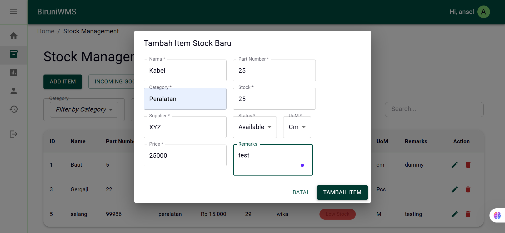
>
- **Penambahan Barang pada Tabel**
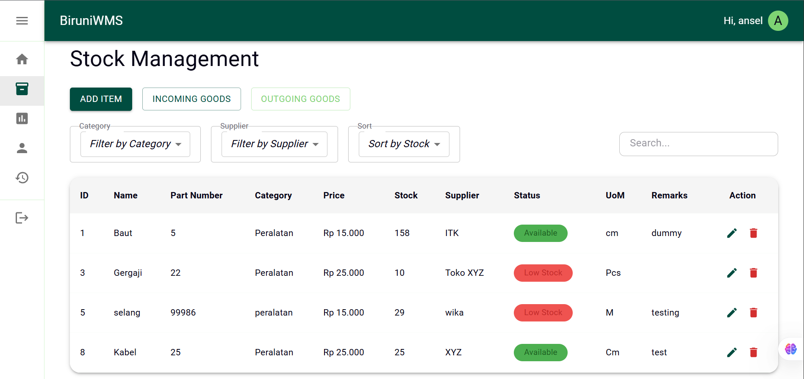
>
- **(UPDATE) Mengedit Data**
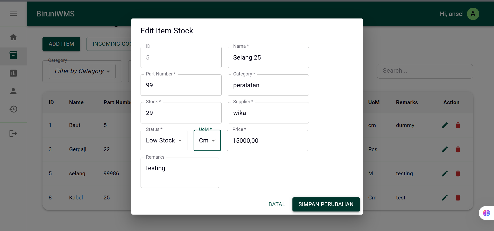
>
- **(DELETE) Menghapus Barang**

>
- **Hasil Mengedit dan Menghapus Barang**
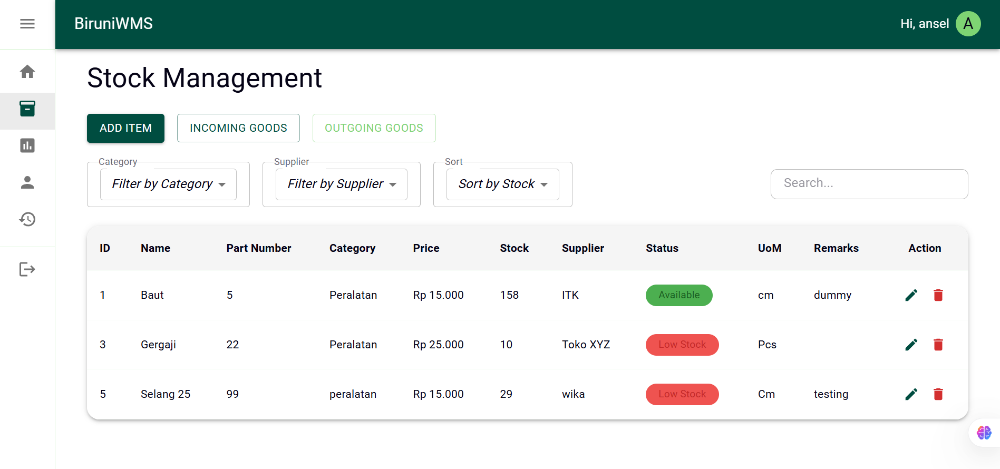
>

---

### 3. Barang Masuk & Keluar + History
- **Barang Masuk**
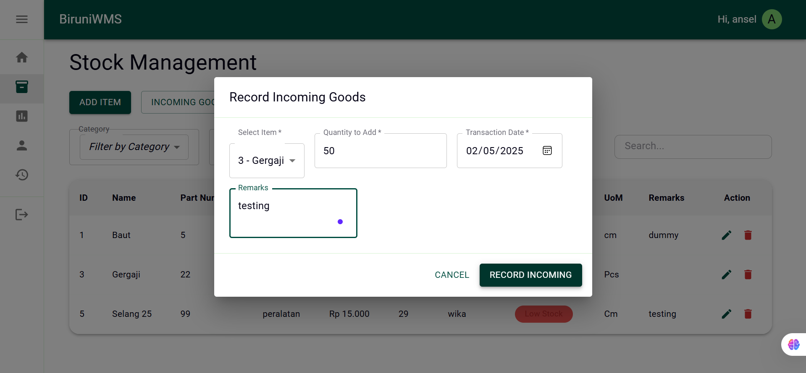
>
- **Barang Keluar**
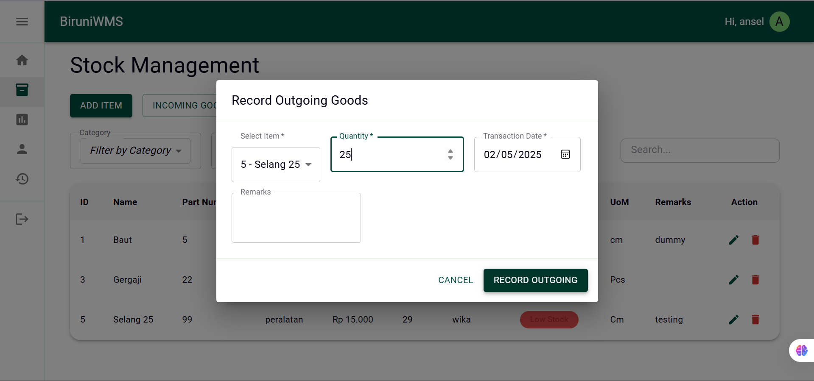
>
- **Notifikasi di halaman History**
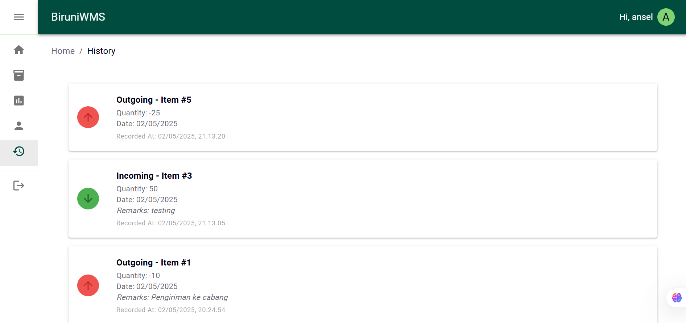
>
---

### 3. Endpoint Dasar

# 📦 Warehouse Management System - Dokumentasi API

### 🛠️ Authentication Endpoints
| Route             | Method | Access  | Deskripsi                                     |
| :---------------- | :----- | :------ | :-------------------------------------------- |
| `/register`       | POST   | Public  | Mendaftarkan pengguna baru.                  |
| `/login`          | POST   | Public  | Melakukan proses login pengguna.            |

---

### 📦 Stock Management Endpoints
| Route               | Method | Access  | Deskripsi                                           |
| :------------------ | :----- | :------ | :---------------------------------------------------- |
| `/stock`            | GET    | Private | Mengambil semua data stok barang. Support search, filter, sort. |
| `/stock/:id`        | GET    | Private | Mengambil satu data stok berdasarkan ID.              |
| `/stock`            | POST   | Private | Menambahkan data stok barang baru ke sistem.          |
| `/stock/:id`        | PUT    | Private | Mengubah seluruh field stok berdasarkan ID.           |
| `/stock/:id`        | DELETE | Private | Menghapus data stok barang berdasarkan ID.             |
| `/stock/incoming`   | POST   | Private | Mencatat transaksi barang masuk.                      |
| `/stock/outgoing`   | POST   | Private | Mencatat transaksi barang keluar.               
| `/history`   | POST   | Private | Mengambil riwayat masuk/keluar.                     |

---

### 6. Pengujian Integrasi (Integration Test)

- **Get Stock by ID**
  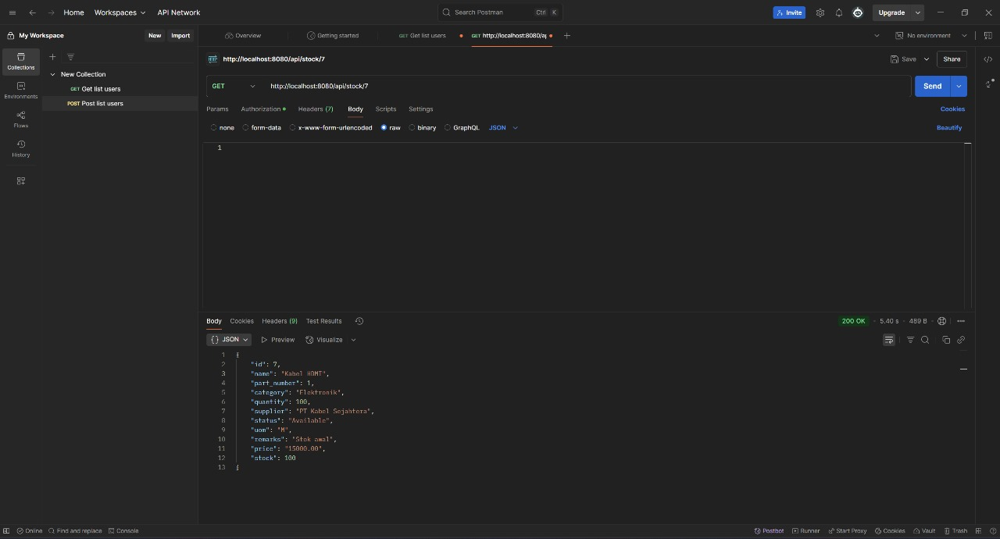
Pengujian GET `/api/stock/7` untuk mengambil data stok dengan ID 7.
- **Get All Stock**
  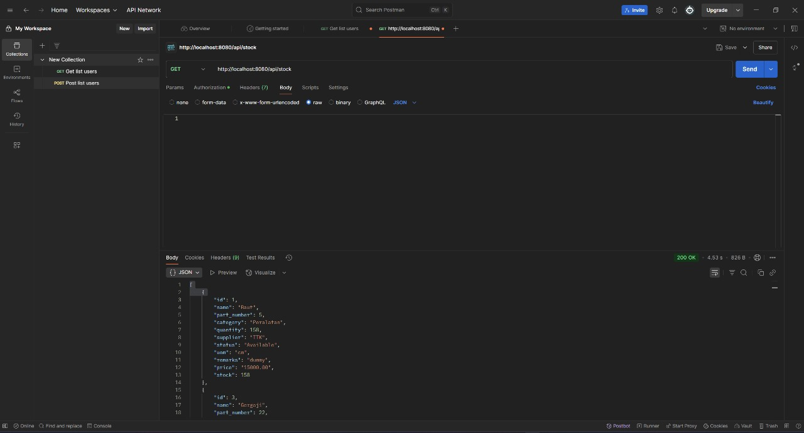
Pengujian GET `/api/stock/` untuk mengambil semua data stok.
- **Add New Item**
  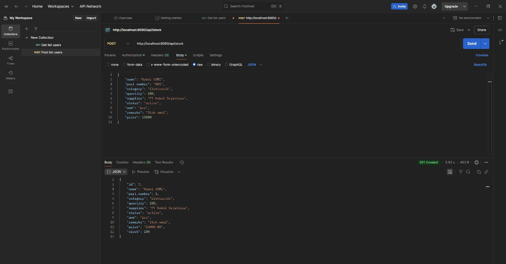
 Pengujian POST `/api/stock/` untuk menambahkan data stok baru.
- **Update Existing Stock**
  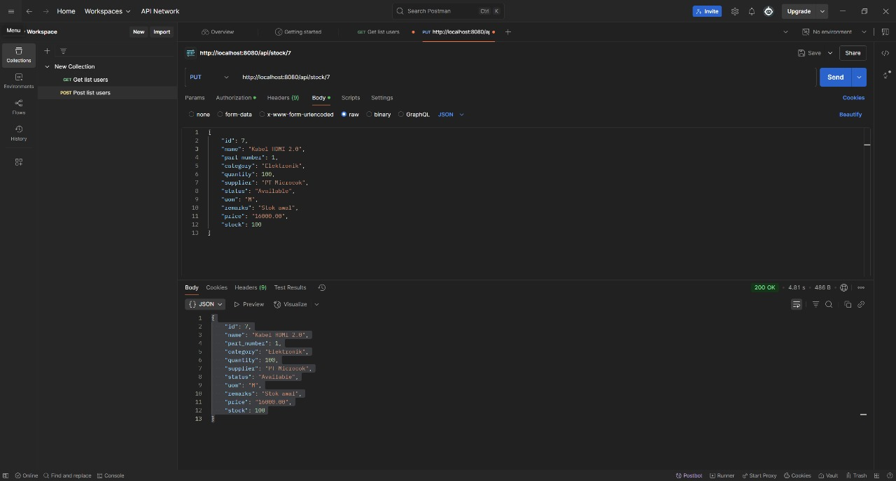
 Pengujian PUT `/api/stock/7` untuk mengubah data stok dengan ID 7.
- **Delete Existing Stock**
  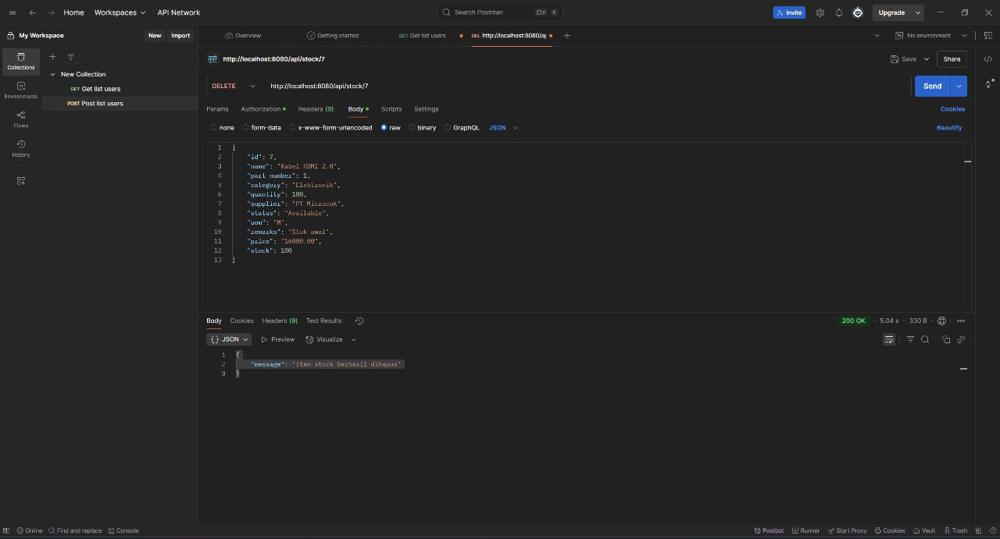
Pengujian DELETE `/api/stock/7` untuk menghapus data stok dengan ID 7.
- **Added Incoming Stock**
  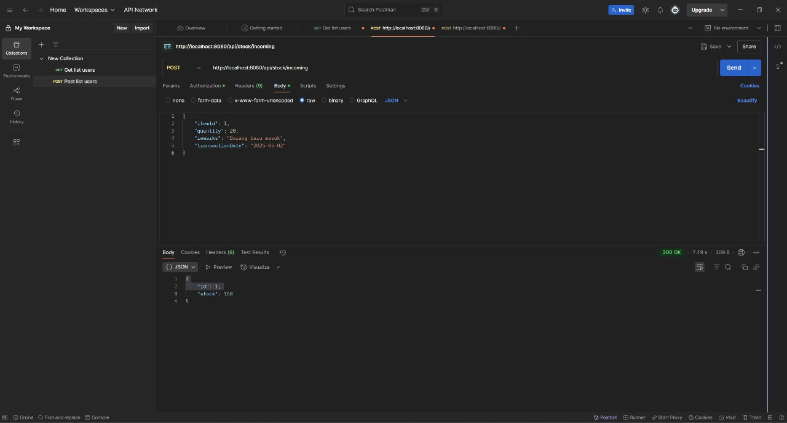
Berhasil menambahkan transaksi barang masuk menggunakan POST `/api/stock/incoming`.
- **Added Outgoing Stock**
  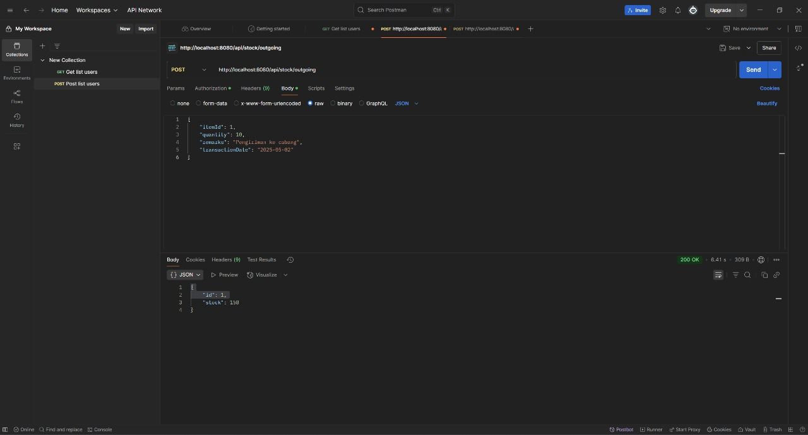
Berhasil menambahkan transaksi barang keluar menggunakan POST `/api/stock/outgoing`.
- **Registering New Account**
  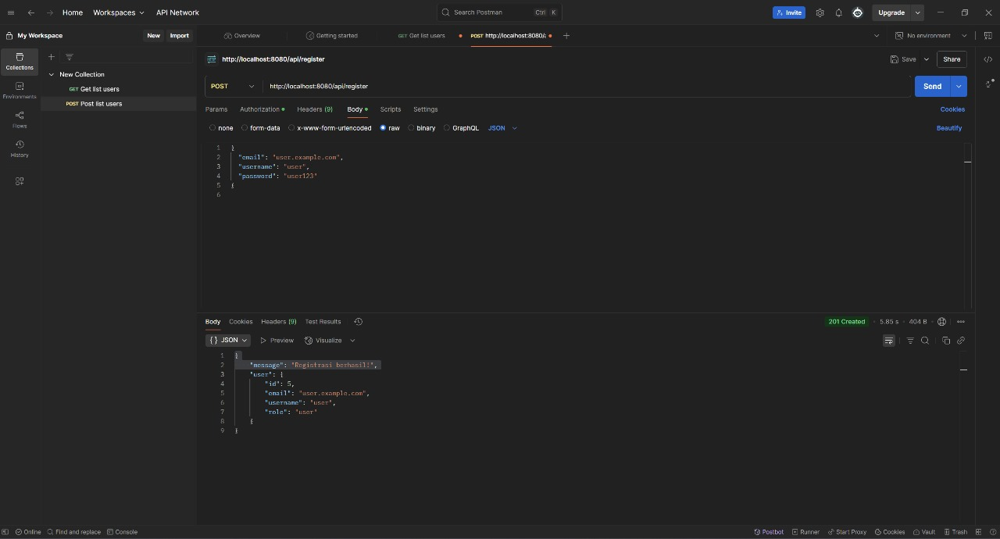
Berhasil mendaftarkan akun baru menggunakan POST `/api/register`.
- **Viewing History**
  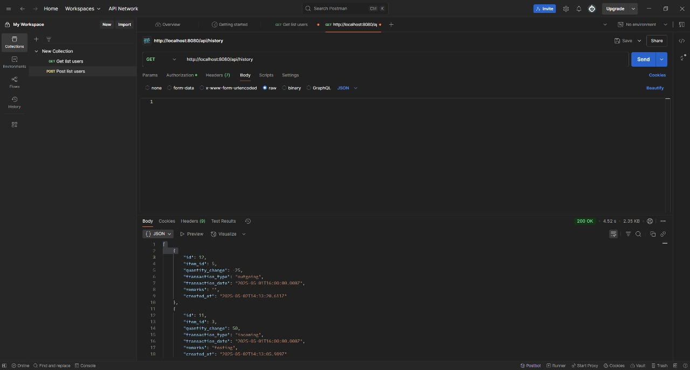
Berhasil menampilkan riwayat barang masuk/keluar menggunakan GET `/api/history`.

---