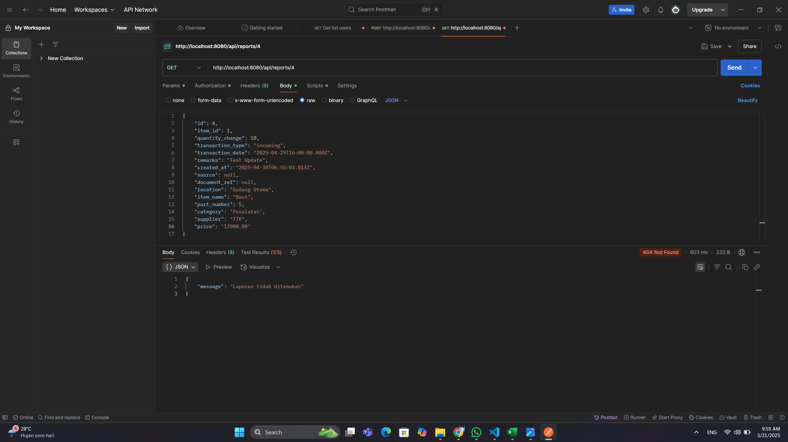

# 📌 Laporan Progres Mingguan - **Sistem Manajemen Gudang Biruni**

**Kelompok**: 7  
**Anggota**:
- Adhyasta Firdaus (10231005)
- Ansellma Tita Pakartiwuri Putri (10231017)
- Dhiya Afifah (10231031)
- Gabriel Karmen Sanggalangi (10231039)

**Mitra**: PT. Biruni Altha Etam  
**Pekan ke-**: 14  
**Tanggal**: 20 Mei 2025

---

## 📈 Ringkasan Progres

Pada minggu ini, kami berhasil menyelesaikan beberapa fitur tambahan, antara lain:

- Penambahan dan pembaruan laporan transaksi
- Fitur filter laporan berdasarkan alur barang
- Fitur ekspor laporan
- Visualisasi data pada dashboard
- Notifikasi otomatis jika stok barang menipis

---

## ✅ Tugas yang Diselesaikan

- **Add Report**: Menambahkan fitur untuk membuat laporan transaksi barang masuk/keluar.
- **Filter Report**: Mengimplementasikan filter laporan berdasarkan kriteria tertentu.
- **Edit Report**: Memungkinkan pengguna mengubah laporan yang telah dibuat.
- **Export Report**: Menambahkan fitur ekspor laporan ke dalam format PDF dan Excel.
- **Visualization Dashboard**: Menampilkan data dalam bentuk grafik dan visual lainnya.
- **Notifikasi Stok Menipis**: Menampilkan peringatan otomatis jika stok berada di bawah ambang batas.

---

## ⚡ Tantangan & Solusi

| Tantangan                                         | Solusi                                                                 |
|--------------------------------------------------|------------------------------------------------------------------------|
| Error pada pengujian integrasi report            | Membuat controller baru (`reportController`) agar API dapat diakses melalui Postman |
| Sinkronisasi data dengan database                | Melakukan penyesuaian struktur database dan perbaikan kode program     |

---

## 📅 Rencana Minggu Depan

- **Penyempurnaan Fitur**: Mengoptimalkan fitur yang masih belum sempurna dan menyelaraskan antar fitur.
- **Bugfix Report**: Mengidentifikasi dan memperbaiki bug pada sistem report.
- **Usability Testing**: Melakukan pengujian kegunaan dengan minimal 3 pengguna.
- **Deployment Plan**: Menyusun rencana deployment sistem, termasuk hosting dan domain.
- **Penyempurnaan Dokumentasi**: Melengkapi dokumentasi (README, API docs, user manual).
- **Final Presentation**: Menyiapkan slide dan demo sistem berdurasi ±15-20 menit.

---

## 🤝 Kontribusi Anggota

- **Adhyasta Firdaus**: Mengembangkan fitur tambah & ekspor laporan (PDF, Excel), serta integrasi dashboard dengan database.
- **Dhiya Afifah**: Memperbaiki halaman login dan menyesuaikan tampilan dashboard.
- **Ansellma Tita Pakartiwuri Putri**: Membantu backend dan frontend dalam penanganan error.
- **Gabriel Karmen Sanggalangi**: Melakukan pengujian integrasi API report dan menyusun laporan minggu ke-14.

---

## 🖼️ Tangkapan Layar / Demo

Berikut tangkapan layar yang menunjukkan fitur-fitur dan progres minggu ini:

### 1. CRUD Report Management

- **Tambah Report**  
  

- **Hasil Penambahan Report**  
  

- **Update Report**  
  

- **Hasil Update Report**  
  

- **Filter Report**  
  

- **Hasil Filter Report**  
  

- **Ekspor Report**  
  

- **Ekspor ke PDF**  
  

- **Ekspor ke Excel**  
  

---

### 2. Dashboard

- **Tampilan Dashboard**  
  

- **Visualisasi Data**  
  

- **Notifikasi Stok Menipis**  
  

---

### 3. Dokumentasi API - Report Management

| Route            | Method | Access   | Deskripsi                                                                 |
|------------------|--------|----------|---------------------------------------------------------------------------|
| `/Report`        | GET    | Private  | Mengambil semua data laporan. Mendukung fitur search, filter, dan sort. |
| `/Report/:id`    | GET    | Private  | Mengambil satu data laporan berdasarkan ID.                              |
| `/Report/:id`    | PUT    | Private  | Mengubah data laporan berdasarkan ID.                                    |
| `/Report/:id`    | DELETE | Private  | Menghapus laporan berdasarkan ID.                                        |

---

### 4. Pengujian Integrasi (Integration Test)

- **GET Report by ID**  
    
  Pengujian endpoint: `GET /api/Report/4`

- **GET All Reports**  
    
  Pengujian endpoint: `GET /api/Report/`

- **Update Report**  
    
  Pengujian endpoint: `PUT /api/Report/4`

- **Delete Report**  
    
  Pengujian endpoint: `DELETE /api/Report/4`

- **Check Deleted Report**  
    
  Mengecek kembali data dengan `GET /api/Report/4` untuk memastikan data telah dihapus.

---
