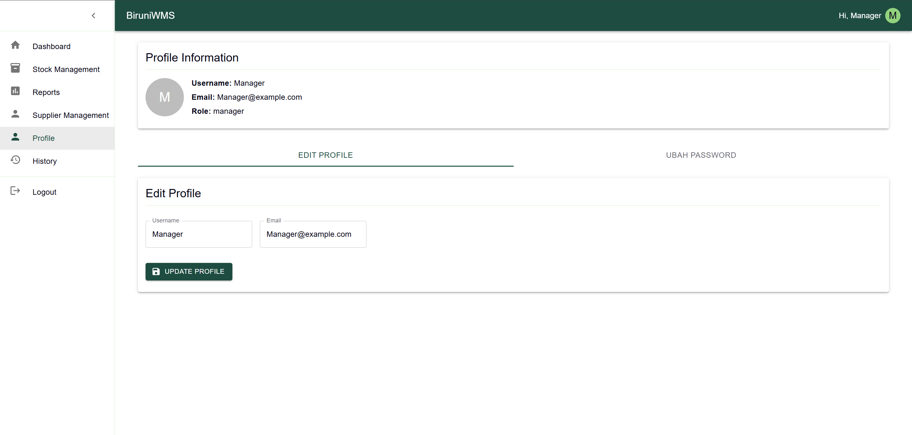
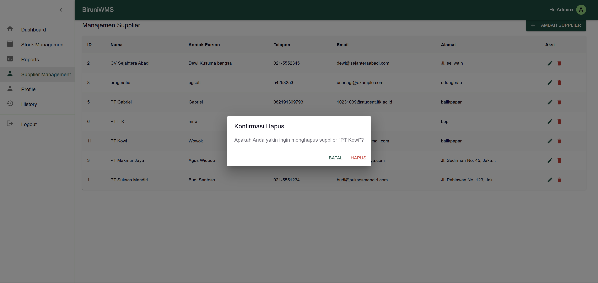

# 📌 Laporan Progres Mingguan - **Sistem Manajemen Gudang Biruni**

**Kelompok**: 7  
**Anggota**:
- Adhyasta Firdaus (10231005)
- Ansellma Tita Pakartiwuri Putri (10231017)
- Dhiya Afifah (10231031)
- Gabriel Karmen Sanggalangi (10231039)

**Mitra**: PT. Biruni Altha Etam  
**Pekan ke-**: 15  
**Tanggal**: 23 Mei 2025

---

## 📈 Ringkasan Progres

Pencapaian kami minggu ini mencakup penyelesaian berbagai fitur tambahan dan penyempurnaan fungsionalitas sistem. Beberapa perbaikan utama meliputi penambahan fitur pemasok, perbaikan bug penghapusan laporan, dan penyesuaian tampilan.

Kami juga telah menghapus fitur registrasi dan melakukan berbagai perbaikan minor lainnya. Selaras dengan itu, kami juga sukses dalam memperbaiki bug pada laporan, melaksanakan pengujian kegunaan (usability testing) untuk mengoptimalkan pengalaman pengguna, serta melengkapi dokumentasi sistem dengan README, dokumentasi API, dan panduan pengguna. Semua hasil kerja keras ini akan kami rangkum dalam slide presentasi final dan demonstrasi sistem kami.

---

## ✅ Tugas yang Diselesaikan

- **Penyempurnaan fitur**: Kami menambah beberapa fitur tambahan untuk mendukung core fitur kami serta meperbaiki fitur-fitur yang masih eror di minggu sebelumnya.
- **Bugfix Report**: Mencari tahu bug yang terjadi pada sistem dan juga solusi penyelesaian masalahnya.
- **Usability Testing**: Melakukan pengujian kegunaan dengan minimal  pengguna.
- **Penyempurnaan Dokumentasi**: Kami Menambahkan beberapa dokumentasi tambahan seperti README, API Documentation, serta User manual.
- **Final Presentation**: Membuat slide presentasi dan juga demo sistem.

---

## ⚡ Tantangan & Solusi

| Tantangan                                         | Solusi                                                                 |
|--------------------------------------------------|------------------------------------------------------------------------|
| Error pada pengujian integrasi report            | Membuat controller baru (`reportController`) agar API dapat diakses melalui Postman |
| Sinkronisasi data dengan database                | Melakukan penyesuaian struktur database dan perbaikan kode program     |

---

## 📅 Rencana Minggu Depan

- **Penyempurnaan Fitur**: Mengoptimalkan fitur yang masih belum sempurna dan menyelaraskan antar fitur.
- **Bugfix Report**: Mengidentifikasi dan memperbaiki bug pada sistem report.
- **Usability Testing**: Melakukan pengujian kegunaan dengan minimal 3 pengguna.
- **Penyempurnaan Dokumentasi**: Melengkapi dokumentasi (README, API docs, user manual).
- **Final Presentation**: Menyiapkan slide dan demo sistem berdurasi ±15-20 menit.

---

## 🤝 Kontribusi Anggota

- **Adhyasta Firdaus**: Backend
* *Menyelesaikan beberapa fitur utama:*
    * *Pengembangan API:* Membuat atau menyempurnakan endpoint API untuk mendukung fitur-fitur baru di frontend (misalnya, API untuk manajemen pengguna, pemrosesan pesanan, upload gambar, dll.).
    * *Logika Bisnis:* Mengimplementasikan semua aturan dan proses bisnis di sisi server, seperti validasi data, perhitungan, atau alur kerja tertentu.
    * *Penanganan Error:* Mengembangkan mekanisme penanganan kesalahan yang robust dan memberikan pesan error yang informatif ke frontend.
* *Melakukan penyesuaian pada website:*
    * *Optimasi Performa:* Mengidentifikasi dan memperbaiki bottleneck pada kode backend atau kueri database yang memperlambat website.
    * *Perbaikan Bug:* Menganalisis dan memperbaiki bug yang dilaporkan, baik dari hasil testing DevOps maupun feedback pengguna.

- **Dhiya Afifah**: Frontend
* *Memperbaiki format *layout pada beberapa halaman:**
    * *Responsivitas:* Memastikan layout halaman beradaptasi dengan baik di berbagai ukuran layar (desktop, tablet, mobile) 
    * *Konsistensi Desain:* Menyelaraskan layout dengan design system atau panduan UI/UX yang ada untuk menciptakan pengalaman yang konsisten.
    * *Penataan Elemen:* Menyesuaikan posisi, ukuran, dan jarak antar elemen (misalnya, button, form, gambar, teks) agar terlihat lebih rapi dan estetis.
    * *Penggunaan Komponen:* Mengoptimalkan penggunaan komponen UI yang ada atau membuat yang baru untuk efisiensi dan konsistensi.
    * *Debug Tampilan:* Mengidentifikasi dan memperbaiki masalah rendering atau styling yang menyebabkan layout terlihat berantakan di browser yang berbeda.

- **Ansellma Tita Pakartiwuri Putri**: UI/UX

* *Memantau perkembangan:*
    * *Review Desain:* Secara berkala meninjau implementasi desain frontend untuk memastikan sesuai dengan mockup dan prototype yang telah dibuat.
    * *Analisis Pengguna:* Menggunakan tools analisis (misalnya, Google Analytics, Hotjar) untuk memahami perilaku pengguna di website, mengidentifikasi pain points, dan area yang perlu ditingkatkan.
    * *Komunikasi Tim:* Berinteraksi aktif dengan tim frontend dan backend untuk memastikan pemahaman yang sama mengenai alur pengguna dan fungsionalitas.
* *Memberikan *feedback:**
    * *Uji Usabilitas:* Melakukan uji usabilitas (baik formal maupun informal) untuk mengumpulkan feedback langsung dari pengguna mengenai kemudahan penggunaan website.
    * *Rekomendasi Peningkatan:* Memberikan saran konkret dan terperinci kepada tim frontend mengenai perbaikan layout, alur navigasi, penempatan elemen, atau teks untuk meningkatkan pengalaman pengguna.
    * *Iterasi Desain:* Membuat revisi mockup atau prototype berdasarkan feedback yang diterima dan hasil analisis untuk panduan tim pengembangan.

- **Gabriel Karmen Sanggalangi**: DevOps
* *Melakukan *testing kepada website:**
    * **Unit Testing:** Memastikan setiap unit kode backend dan frontend berfungsi sesuai harapan. (Meskipun sering dilakukan oleh developer sendiri, DevOps mungkin terlibat dalam setup framework testing atau review cakupan test).
    * **Integration Testing:** Menguji bagaimana berbagai modul atau layanan di website berinteraksi satu sama lain (misalnya, frontend berkomunikasi dengan backend, backend berkomunikasi dengan database).
    * **End-to-End (E2E) Testing:** Mensimulasikan alur pengguna secara keseluruhan dari awal hingga akhir untuk memastikan semua fungsionalitas inti bekerja dengan baik.
    * **Usability Testing:** (Berkolaborasi dengan UI/UX) Menguji kemudahan penggunaan website dari perspektif pengguna.
    * **Cross-Browser/Device Testing:** Memastikan website berfungsi dengan baik di berbagai browser dan perangkat.
* *Menyampaikan hasilnya untuk *backend memperbaikinya:**
    * *Pelaporan Bug:* Mencatat bug atau isu yang ditemukan selama testing dengan detail yang jelas (langkah replikasi, expected result, actual result, screenshot/video jika perlu).
    * *Prioritisasi Isu:* Berkomunikasi dengan Backend untuk membantu memprioritaskan perbaikan berdasarkan tingkat keparahan dan dampaknya.
    * *Verifikasi Perbaikan:* Setelah backend melakukan perbaikan, DevOps akan melakukan re-testing untuk memastikan bug benar-benar sudah diperbaiki dan tidak ada efek samping yang tidak diinginkan (regression testing).

---

## 🖼️ Tangkapan Layar / Demo

Berikut tangkapan layar yang menunjukkan fitur-fitur dan progres minggu ini:

### 1. Penyempurnaan fitur

- **Role-Based Access Control**  
    implementasi role -base acces conrtol untuk membahasi hak akses antara role admin dan manager
    * Tampilan Manager:
       Halaman Stok Manager
      Halaman Report Manager
      Halaman Supplier Manager
      Halaman Profile Manager
    * Tampilan Admin:
      Halaman Stok Admin
      Halaman Report Admin
      Halaman Supplier Admin
      Halaman Profile Admin
- **Kelola User**  
    Role admin dapat mengelolah user seperti menambahkan dan menghapus user
    * Menambahkan users
      
    * Mengedit users
      
    * Menghapus users
      
- **Mengelolah supliers**  
    Role admin dapat mengelolah data suplier seperti menambahkan, mengedit informasi dan menghapus suppliers
    * Menambahkan suppliers
      
    * Mengedit suppliers
      
    * Menghapus suppliers
      
- **Laporan Stok**  
  
   Admin dan manager dapat mehilat laporan stok barang dalam kurun waktu tertentu
- **Mengubah Password**  
  
  Admin dan manager dapat mengganti pasword dari akun yang sedang digunakan di menu profile

---

### 2. Bug Fix Report 
#### 🔍 Masalah
- **Perilaku saat ini:**
  1. Admin tidak dapat menambah laporan karena tidak dikenali sebagai admin.
  2. Form status barang tidak muncul, menyebabkan stock tidak bisa ditambah.
  3. Gagal menambahkan barang dengan jumlah 1.000.000 atau lebih.
  4. Ekspor laporan stock barang salah, karena malah menampilkan data transaksi.

- **Yang diharapkan:**
  1. Admin terdeteksi dan dapat menambah laporan.
  2. Form status barang muncul di frontend saat tambah stock.
  3. Sistem menerima input jumlah besar seperti 1.000.000+.
  4. Ekspor laporan stock berisi data stock barang yang benar.

#### ✅ Perbaikan
- **Solusi:**
  - Memperbaiki pengecekan role admin di backend.
  - Memastikan frontend memuat form status barang dengan benar.
  - Menyesuaikan validasi jumlah barang di backend/frontend.
  - Koreksi endpoint atau query ekspor agar merujuk ke data stock, bukan transaksi.

---

###  3. Usability Testing Report

##### 📄 Informasi Umum
**Tanggal Pengujian:** [2025-05-24]  
**Tujuan Pengujian:** [Contoh: Menguji kemudahan penggunaan fitur tambah barang dan ekspor laporan]  
**Jumlah Partisipan:** 2 pengguna  
**Metode:** Observasi langsung / Remote / Think-Aloud / Task-Based

---

#### Admin
**Profil:**  
- Nama (alias): User 1  
- Peran: Admin
- Pengalaman Teknologi: Sedang

**Tugas yang Diuji:**
1. Menambah item
2. Menambah barang masuk
3. Menambah supplier
4. Menambah user
5. Menambah laporan

**Hasil & Observasi:**
- **Keberhasilan:** Ya
- **Waktu penyelesaian:** 1 menit 42 detik
- **Catatan Observasi:**  
  - User perlu membaca form terlebih dahulu untuk memahami apa yang perlu di input

#### Manager
**Profil:**  
- Nama (alias): User 2  
- Peran: Manager
- Pengalaman Teknologi: Sedang

**Tugas yang Diuji:**
1. Filter laporan berdasarkan waktu
1. Export laporan

**Hasil & Observasi:**
- **Keberhasilan:** Ya
- **Waktu penyelesaian:** 57 detik
- **Catatan Observasi:**  
  - tidak ada

### 4. Dokumentasi API - Report Management

| Route            | Method | Access   | Deskripsi                                                                 |
|------------------|--------|----------|---------------------------------------------------------------------------|
| `/Suppliers`        | GET    | Private  | Mengambil semua data Supplier. Mendukung fitur search, filter, dan sort. |
| `/Suppliers/:id`    | GET    | Private  | Mengambil satu data Supplier berdasarkan ID.                              |
| `/Suppliers/:id`    | PUT    | Private  | Mengubah data Supplier berdasarkan ID.                                    |
| `/Suppliers/:id`    | DELETE | Private  | Menghapus Supplier berdasarkan ID.                                        |

---

### 5. Pengujian Integrasi (Integration Test)

- **GET  by ID**  
    
  Pengujian endpoint: `GET /api/4`

- **GET All**  
    
  Pengujian endpoint: `GET /api/`

- **Add**  
    
  Pengujian endpoint: `PUT /api/4`

- **Update**  
    
  Pengujian endpoint: `PUT /api//4`

- **Delete**  
    
  Pengujian endpoint: `DELETE /api/4`

- **Check Deleted Supplier**  
    
  Mengecek kembali data dengan `GET /api/supplier/4` untuk memastikan data telah dihapus.

---

### 6. Penyempurnaan dokumentasi
* README:https://github.com/secretceremony/BWMS/blob/main/readme.md
* USER MANUAL: https://github.com/secretceremony/BWMS/blob/main/user_manual.md
* API DOCUMENTATION: https://github.com/secretceremony/BWMS/blob/main/api_documentation.md

---

### 7. Presentation
Link Presentation: https://www.canva.com/design/DAGoO13ysOo/Wyrsr0dQ_HCGXo_dfneZLg/edit?utm_content=DAGoO13ysOo&utm_campaign=designshare&utm_medium=link2&utm_source=sharebutton