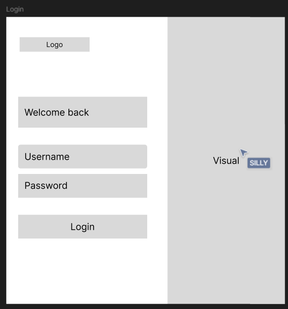
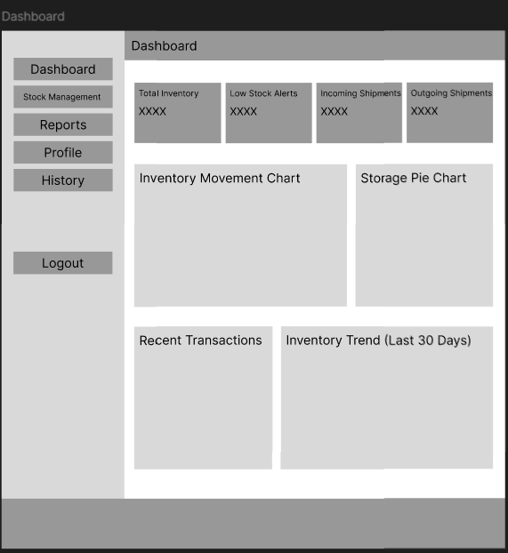
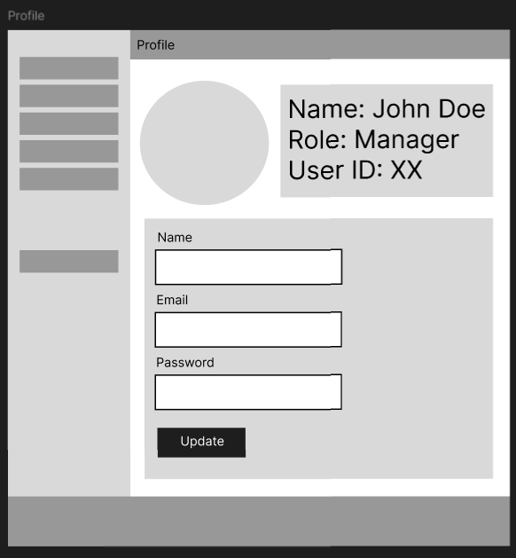
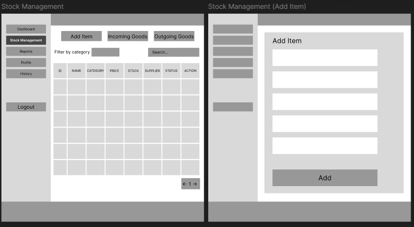
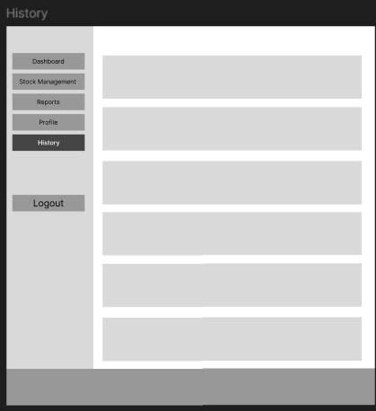
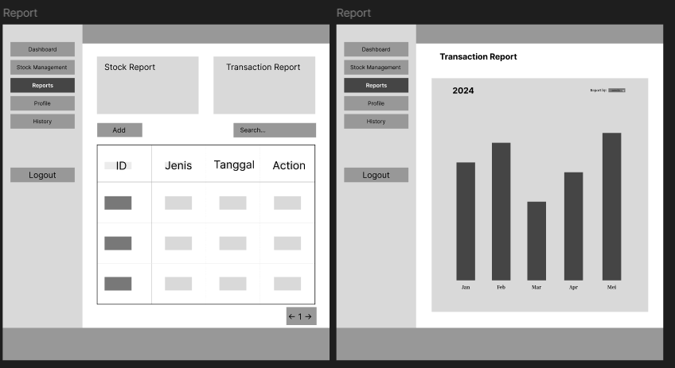

# 📌 Laporan Progres Mingguan - **Sistem Manajemen Gudang Biruni**
**Kelompok**: A7  
**Mitra**: PT. Biruni Altha Etam  
**Pekan ke-**: 9  
**Tanggal**: 13 April 2025  

---

## 🔍 Progress Summary
Pada minggu ini, kami memulai pengerjaan proyek tugas besar mata kuliah *Pemrograman Web*. Fokus utama adalah menyusun dokumen kebutuhan sistem berdasarkan hasil wawancara dengan mitra, menetapkan fitur-fitur MVP, menyusun timeline pengembangan, membuat wireframe/mockup antarmuka, serta menyiapkan struktur awal proyek di repository GitHub yang akan digunakan bersama.

---

## ✅ Accomplished Tasks

### 📄 Deskripsi Kebutuhan Mitra
Berdasarkan wawancara dengan mitra, berikut adalah kebutuhan utama yang diidentifikasi:
1. Sistem manajemen gudang (*Warehouse Management System*) yang dapat melakukan CRUD data barang.
2. Sistem login dengan dua peran: Admin dan Manager.
3. Fitur pelaporan transaksi barang secara real-time dan historis.

### 🚀 Fitur-Fitur MVP
1. **Autentikasi**: Login terpisah untuk Admin & Manager.  
2. **Manajemen Barang**: CRUD barang (nama, deskripsi, jumlah, harga).  
3. **Pencatatan Transaksi**: Input data pembelian dan penjualan.  
4. **Manajemen Stok**: Otomatisasi pembaruan stok berdasarkan transaksi.  
5. **Dashboard**: Ringkasan penjualan dan kondisi stok.  
6. **Laporan**: Laporan penjualan harian/bulanan dan stok barang.

### 🎨 Wireframe / Mockup
#### 1. Login Page

Gambar diatas adalah wireferame dari Login Page  atau halaman login yang berisikan form login dengan input username dan password serta tombol login.
#### 2. Dashboard

Gambar diatas adalah wireframe dari Dashboard atau halaman utama yang berisikan ringkasan penjualan, preview notifikasi, chart dan juga ada side bar yang berisikan menu-menu lainnya.
#### 3. Profile Page

Gambar diatas adalah wireframe dari Profile Page atau halaman profil yang berisikan informasi profil pengguna , tombol ubah profil, tombol ubah password serta tombol logout.
#### 4. Stock Management

Gambar diatas adalah wireframe dari Stock Management atau halaman manajemen stok yang berisikan tabel stok barang, tombol tambah item, search bar, form barang masuk dan keluar, dan juga ada side bar yang berisikan menu-menu lainnya.
#### 5. History

Gambar diatas adalah wireframe dari History atau halaman riwayat yang berisikan Pop up Barang masuk dan keluar
#### 6. Report Page 

Gambar diatas adalah wireframe dari Report page atau halaman laporan yang berisikan tabel laporan transaksi, pemasukan barang, pengeluaran barang, laporan bulanan, stok barang.

### 🗂️ Struktur Proyek (README Overview)
#### 1. Latar Belakang
PT. Biruni Altha Etam adalah perusahaan penyedia komponen/sparepart alat berat. Mereka membutuhkan sistem pengelolaan gudang yang efisien agar proses operasional lebih terorganisir dan terdokumentasi dengan baik.

#### 2. Tujuan
Membangun aplikasi berbasis web yang mendukung pengelolaan inventaris, pencatatan transaksi, dan pelaporan yang membantu pengambilan keputusan bisnis.

#### 3. Fitur MVP
- **Autentikasi**  
- **Manajemen Produk**  
- **Manajemen Stok**  
- **Dashboard Ringkasan**  
- **Laporan Penjualan dan Stok**

#### 4. User Roles
- **Admin**: Akses penuh pada semua fitur.  
- **Manager**: Melihat laporan dan produk (read-only).

#### 5. Tech Stack
- **Frontend**: React (Vite), Material-UI  
- **Backend**: Node.js, Express.js  
- **Database**: PostgreSQL  
- **Authentication**: JSON Web Token (JWT)  
- **Deployment**: Vercel (frontend), Render (backend)

#### 6. Timeline
| Pekan | Kegiatan |
|-------|----------|
| 9-10  | Requirement gathering, wireframe, desain database |
| 11    | Fitur autentikasi & manajemen produk |
| 12-13 | Sistem transaksi & manajemen stok |
| 14    | Dashboard, laporan, perbaikan bug |
| 15    | Finalisasi dan deployment |

---

## ⚠️ Challenges & Solutions

- **Challenge 1**: Mendesain wireframe sesuai dengan kebutuhan mitra
  - **Solution**: Menambah referensi desain serta latihan membuat mockup dari proyek serupa.
  
- **Challenge 2**: Sinkronisasi ide dan komunikasi dalam tim  
  - **Solution**: Menentukan waktu meeting rutin serta pembagian tugas melalui GitHub.

---

## 🔮 Next Week Plan
- Mendesain **Entity Relationship Diagram (ERD)**.  
- Menyusun **skeleton backend** (minimal 2 endpoint CRUD).  
- Menyusun **skeleton frontend** (struktur React dan routing dasar).

---

## 👥 Contributions

- **[Adhyasta Firdaus]**: Pembuatan dokumen kebutuhan dan wireframe  
- **[Gabriel Karmen Sanggalangi]**: Penyusunan fitur MVP, struktur README dan membantu dalam pembuatan wireframe
- **[Dhiya Afifah]**: Timeline pengembangan dan membantu dalam pembuatan wireframe
- **[Ansellma Tita pakartiwuri Putri]**: Setup awal repository GitHub, dan membantu dalam pembuatan wireframe

---

## 🖼️ Demo
> Link Figma (Mockup): https://www.figma.com/design/Ad95ruAboOoi90N2nx8MON/Mockup-A7?node-id=0-1

> Link Repository : https://github.com/secretceremony/BWMS
